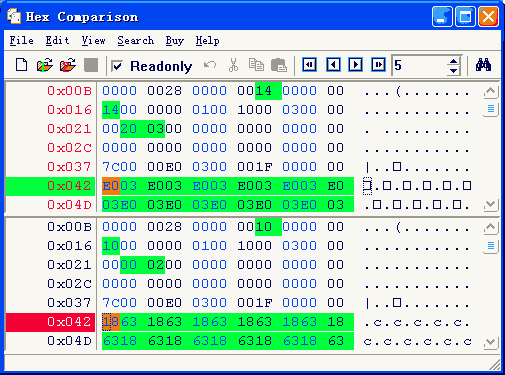

# Hex Comparison version 4.0

<b>Hex Comparison</b> is a binary file comparison and hex editor. It helps you to compare files in binary format, serving as a hex editor.

> Allow quickly compare two files.
Quickly find every different.
Show different with customizing color.
Allow save comparison result to file.
Go to any offset of file quickly.
Create new binary file.
Find synchronous position by double click.
Scroll every different.
Modify binary file or text file easily.
Find binary or ASCII string easily.

You can download official setup file from: http://www.exeicon.com/hex-comparison/download.htm

Or download the setup file from this repository.

Use this key for the activation:

> 9@gmail
>
> 219@GMAIL1YOHHGMITX12345KLIHKSXXHQHTAVJPHFC2

<b>Note: </b> To support the author, buy it. Thank you so much.

 
 
 
 
 
 
 
Donate me via BTC wallet
 
 

bc1qutvpq3msre6es46qtneyk2z40qkgvg80guehaw
